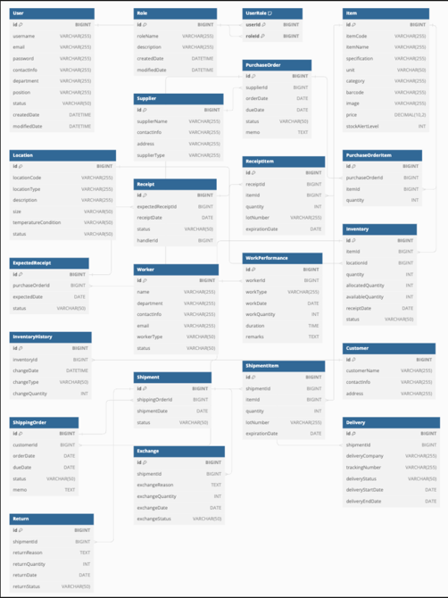

## WMS

### Stack
- Spring
- Spring Boot
- JPA
- MySql 
  - Gradle (빌드)
  - Jenkins(ci/cd툴 => 경험 위함)

### 설치 및 실행 방법

### 주요 기능
1. 대시보드 및 보고서 기능 
   2. 시스템의 전반적인 상태와 주요 지표를 시각적으로 표시합니다. 
2. 구매 관리 
   3. 구매 오더 생성: 필요한 상품을 공급업체로부터 주문하기 위해 구매 오더를 생성합니다.
   4. 구매 오더 목록: 모든 구매 오더를 조회하고 관리합니다.
3. 입고 관리
   4. 입고 예정 관리: 입고 예정 날짜와 수량을 관리하고, 입고 일정을 조정합니다. 
   5. 입고 처리: 실제 입고 작업을 수행하고 시스템에 입고 내역을 기록합니다. 
   6. 입고 검수: 입고된 물품의 품질과 수량을 검수하고 결과를 기록합니다. 
   7. 입고 라벨링: 입고된 물품에 바코드, RFID 등의 라벨을 부착하여 관리합니다. 
   8. 반품 및 교환 관리: 입고된 물품 중 반품되거나 교환되는 물품을 관리합니다.
4. 재고 관리 
   5. 재고 현황: 현재 재고 상태를 조회합니다. 
   6. 재고 추가 및 조정: 새 재고를 추가하거나 수량을 조정합니다. 
   7. 로케이션 관리: 창고 내 물품의 위치를 관리합니다. 
5. 출고 관리 
   6. 출고 오더 생성: 새로운 출고 오더를 생성합니다. 
   7. 출고 오더 목록: 모든 출고 오더를 조회하고 관리합니다.
   8. 배송 상태: 현재 배송 상태를 조회합니다.
6. 고객 및 공급업체 관리 
   7. 고객 관리: 고객 목록을 조회하고 새로운 고객을 추가합니다.
   8. 공급업체 관리: 공급업체 목록을 조회하고 새로운 공급업체를 추가합니다. 
7. 상품 관리
   8. 상품 목록: 모든 상품 목록을 조회합니다.
   9. 상품 추가: 새로운 상품을 추가합니다.
8. 작업자 관리 
   9. 작업자의 정보를 관리하고 작업 성과를 기록합니다.
9. 설정 및 관리 기능 
   10. 시스템 설정을 관리하고 사용자 권한을 설정합니다.

### API 정보

### 데이터 모델

